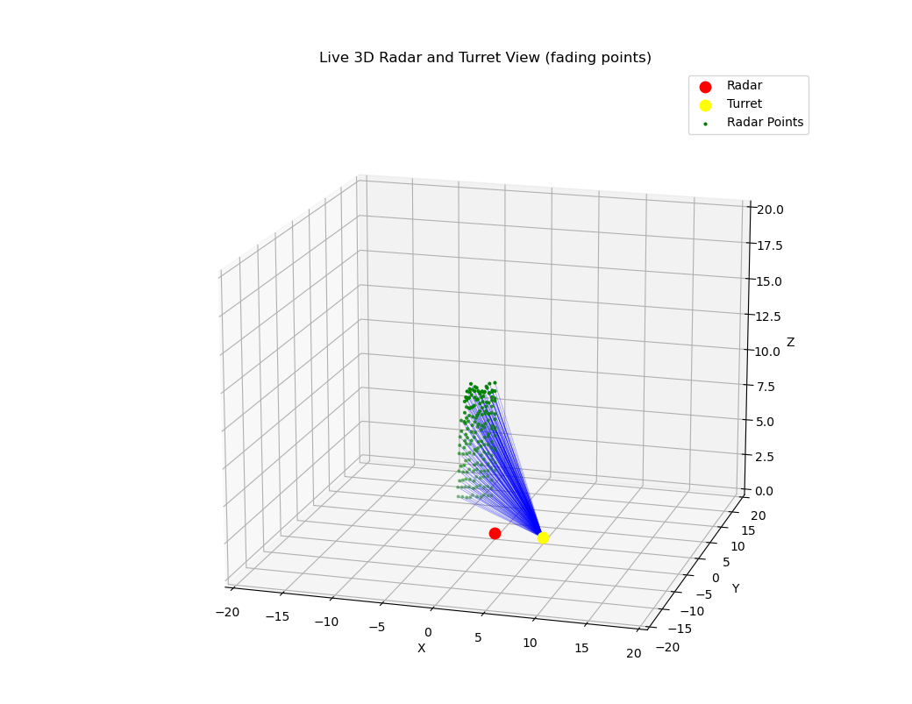

# Radar-Turret Simulation

This project simulates a 3D radar scanning system and a reactive turret that translates radar readings into turret movements. It features real-time point generation from a radar sensor and a visualization of the turret's response using Python and Matplotlib.

## Project Structure

* `main.c`: C simulation that generates radar data and converts it to turret coordinates.
* `radar.txt`, `turret.txt`: Files containing radar and turret data, respectively.
* `points.py`: Python script that visualizes radar points and turret tracking rays in 3D using `matplotlib`.
* GitHub repo: [Radar-Turret-Simulation](https://github.com/EgozS/Radar-Turret-Simulation.git)

---

## How It Works

1. **Radar Emulation (C Code)**:

   * Simulates a rotating radar sweeping 360° horizontally.
   * At each horizontal step, it sweeps vertically (0–45° up and down).
   * For each point, it calculates:

     * Radar reading (angle, elevation, distance)
     * Turret response (adjusted angle, elevation, distance from turret's perspective)
   * Flushes data to `radar.txt` and `turret.txt` in real-time.
   * Sweeping alternates direction each cycle (up, then down).

2. **Turret Conversion Logic**:

   * Converts radar spherical coordinates to Cartesian.
   * Translates radar coordinates from the radar's origin to the turret's offset location.
   * Computes the turret's required aim to hit the detected point using trigonometry.

3. **Visualization (Python)**:

   * Reads points from the live-updating `*.txt` files.
   * Converts polar/spherical coordinates to Cartesian.
   * Displays:

     * Radar location and green scan points.
     * Turret location and blue pointing vectors.
     * Old points disappear after a few seconds (cooldown effect).
   * Updates in real-time using Matplotlib’s interactive mode.

---

## Dependencies

### C Code

* Standard C libraries: `math.h`, `stdlib.h`, `stdio.h`, `time.h`, `unistd.h`, `stdbool.h`

### Python

Install required Python packages:

```bash
pip install matplotlib numpy
```

---

## Running the Simulation

### 1. Run the C Simulator

```bash
make
./main
```

This will create/update `radar.txt` and `turret.txt` with live radar and turret data.

### 2. Run the Visualizer

```bash
python3 points.py
```

You'll see a real-time 3D view of radar detections and turret responses.


## Sample Output

* Radar shown at origin (red)
* Turret shown offset at (5, 0, 0) (yellow)
* Radar detections = green points
* Turret pointing lines = blue



---

## Future Ideas

* Integrate with real hardware (ESP32, servo, laser pointer)
* Add WebSocket or MQTT for real-time data streaming
* Switch from file-based IO to sockets or shared memory

---

## Author

**Egoz S.**
GitHub: [@EgozS](https://github.com/EgozS)
